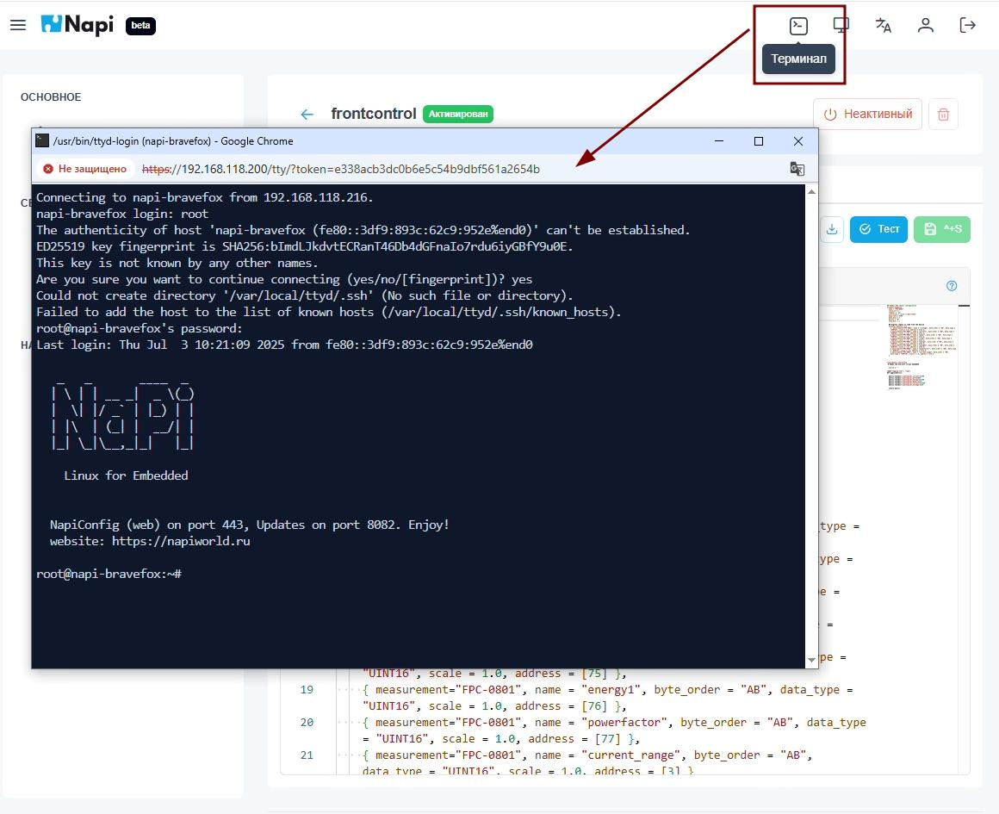

## Первое обновление - 0.2.2

По горячим следам выкатываем первые обновления. Внутри - исправление ошибок и новая супер-фича (которую мы хотели очень давно) - **ssh терминал прямо из Веб интерфейса**

>**Скачать: https://download.napilinux.ru/napilinux/0.2.2/**

## Что нового

- :fire: Терминальный клиент ssh из коробки :fire:

Терминал полностью функционален, как будто вы вошли через ssh клиент !

## Исправили ошибки

- Исправили некорректное отображение данных в графиках
