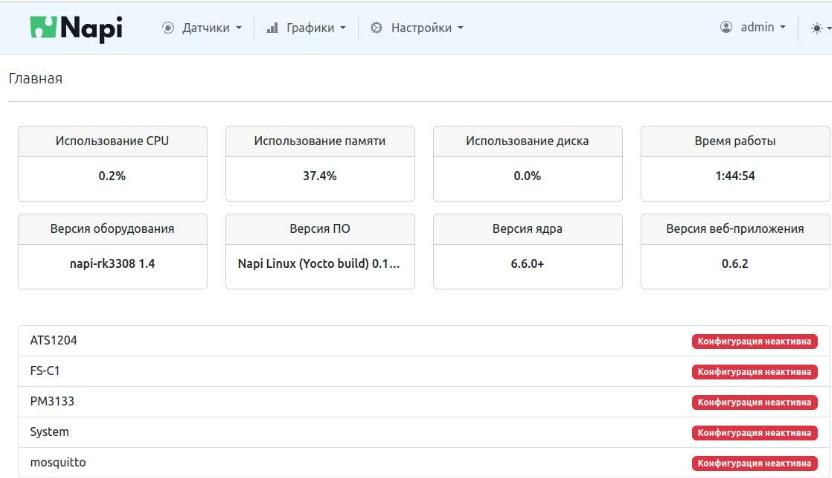
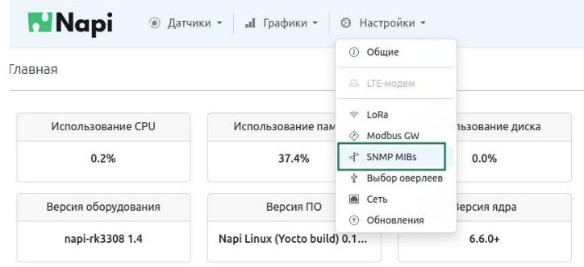
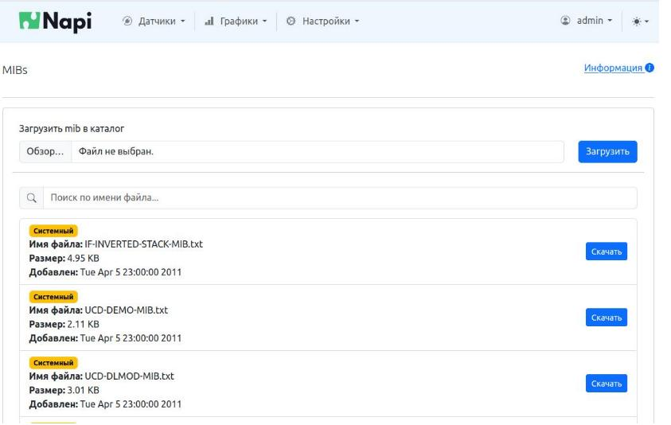
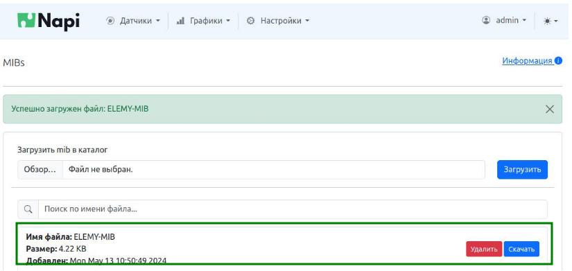
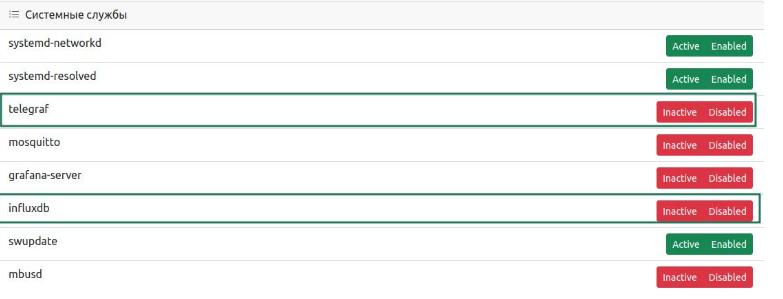
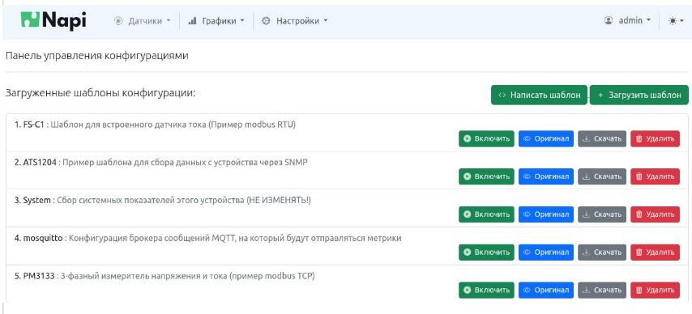
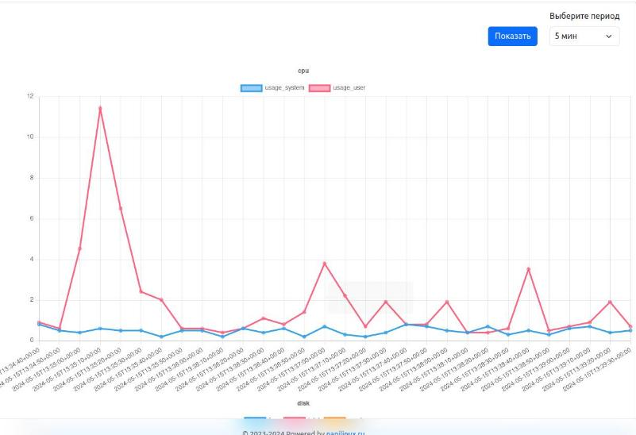
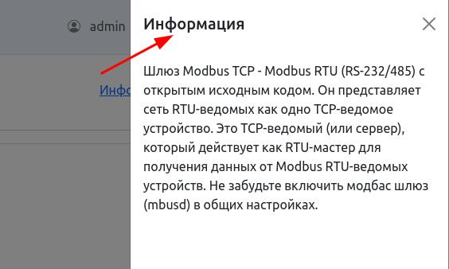
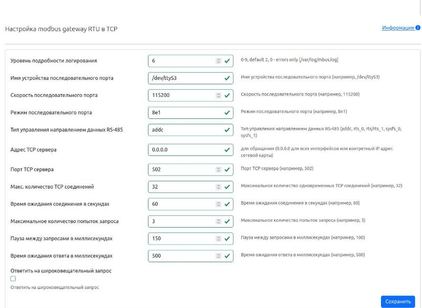

## Что нового в прошивке 0.1.19

### Состав Linux

- mbusd обновлен до 0.5.2
- добавлена утилита mbpoll (опрос по modbus tcp\rtu), modpoll также присутствует
- добавлена утилита htop
- добавлены утилиты для работы с snmp (snmp-tools) и mibs

### NapiConfig

- Новая главная страница



- Добавлена возможность закачивать MIB-файлы для дальнейшего опроса по SNMP через Telegraf

>Новое меню



>Возможность загружать MIB-ы (системные уже загружены). Можно подгружать несколько MIB-файлов



>Загруженный MIB можно удалить



- Добавлена возможность управлять некоторыми сервисами Linux (telegraf, mbusd, influx, mosquitto)



- Добавлены шаблоны датчиков для опроса по протоколам
  - Modbus RTU
  - Modbus TCP
  - SNMP 



- Добавлен системный "датчик" мониторинга системных параметров (загрузка процессора, диска, памяти). Работает только при запущенных сервисах telegraf, influx

- Экспериментально добавлены графики датчиков. Работает только при запущенных сервисах telegraf, influx



- Появилась вкладка "Информация", с краткой справкой



- Появился Веб-интерфейс к открытому шлюзу Modbus RTU-TCP. Не забудьте включить службу. Учитывайте что сервис mbusd блокирует RS485 порт, утилиты modpoll\mbpoll и telegraf в режиме modbus rtu работать не будут. 



## Известные проблемы

- Апдейт системы не работает из Веб-интерфейса, необходимо пользоваться swupdate который доступен через веб по адресу: http://IP:8082
- После Апдейта через swupdate надо перегрузить устройство вручную (через ssh или Веб) 
- Без включенных служб telegraf\influx графики не отображаются (могут выскакивать ошибки)
- Для того, чтобы редактировать файл датчика, его надо включить. При этом, если файл неправильный, то telegraf не запустится. После редактирования файла датчика при корректном конфиге telegraf запустится автоматически (если включена его служба).
- Для проверки корректности работы telegraf (идут данные или нет, какие данные идут), необходимо пользоваться командной строкой, скоро это можно будет сделать через Веб

## Как проверить корректность работы Telegraf

В командной строке набрать команду, гасить службу telegraf при этом необязательно.

```
root@napi-rk3328:~# telegraf --test -config /etc/telegraf/telegraf.conf --config-directory /data/active/

```
Также для подробного вывода можно использовать флажок ```--debug``

Узнать запустилась ли служба можно командой

```
systemctl status telegraf
```

Или через Веб-интерфейс (зеленая (Active) \ красная(Inactive)), но надо также учитывать что Веб-интерфейс обновляется с задержкой.

