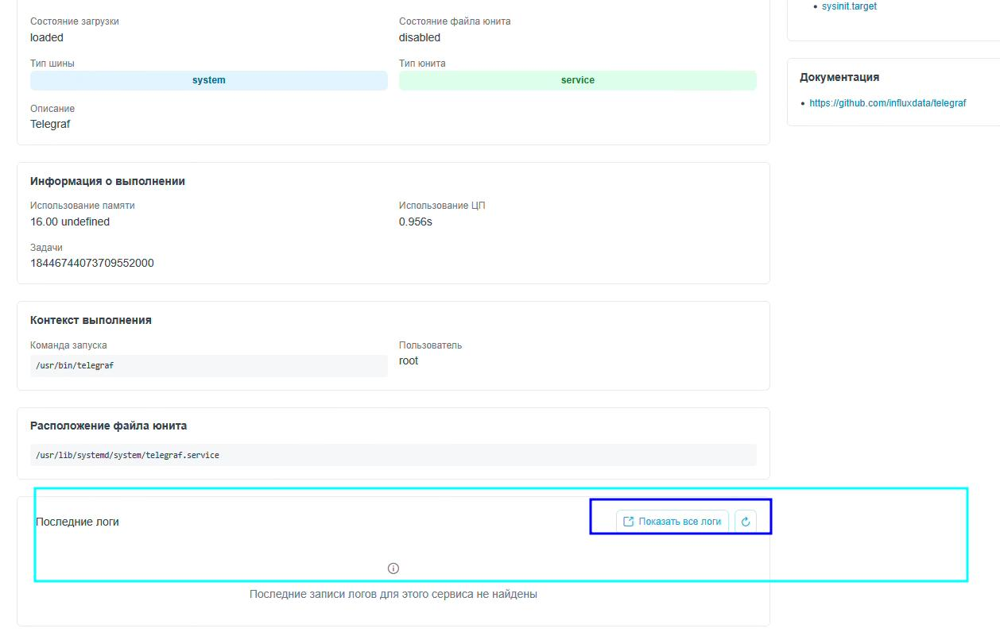
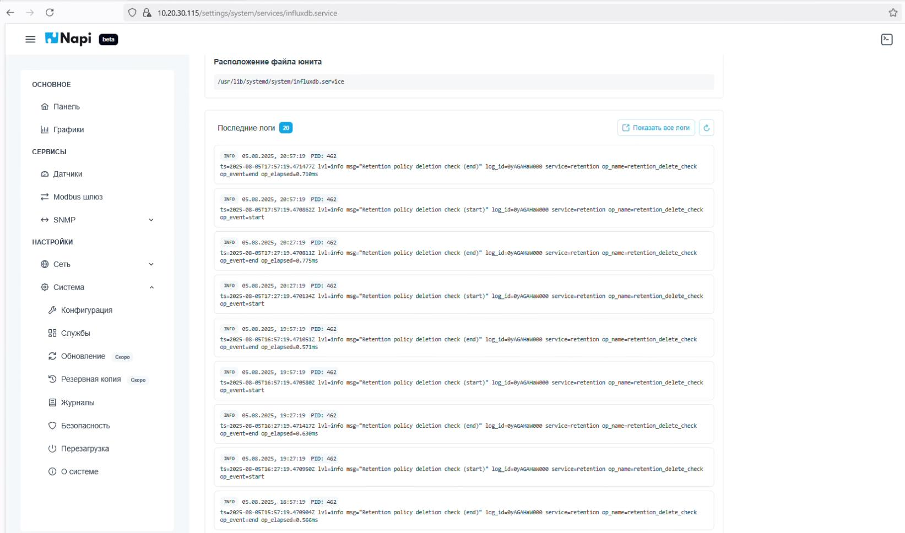
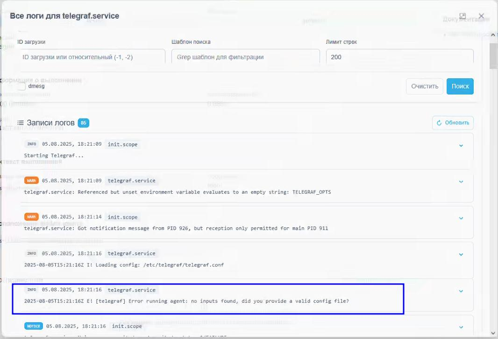

## Очередное обновление - 0.2.3

>**Скачать: https://download.napilinux.ru/napilinux/0.2.3/**

## Что нового

Добавлены логи запуска служб и сервисов. Из Веб-интерфейса можно смотреть логи запуска службы. (раньше для этого приходилось "бежать" в командную строку и вызывать joutrnalctl).

Пример: служба influx

Пример: служба telegraf в отдельном окне

## Техно-лог обновления 0.2.3

### Добавлено

- Системные логи: Реализована полная система управления логами
- Компонент SystemBoots.vue для просмотра загрузок системы
- Компонент SystemJournal.vue для просмотра системного журнала
- Компонент SystemJournalDiskUsage.vue для мониторинга использования диска журналом
- Компонент SystemJournalVacuum.vue для очистки журнала
- Компонент useLogs.ts для работы с API логов
- Улучшения в сервисах: Расширен компонент ServiceDetails.vue для отображения логов сервисов
- Локализация: Добавлены переводы для системы логов на 5 языков (немецкий, английский, русский, узбекский, китайский)
- API расширения: Обновлены клиентские схемы и типы для работы с логами

### Изменено

- Обновлен Node.js до версии 22.17.1
- Улучшена конфигурация Vite для лучшей производительности
- Обновлены зависимости проекта
- Удален бейдж "soon" из меню системных логов

### Техническое

- Обновлен OpenAPI схема с новыми эндпоинтами для логов (3590+ строк изменений)
- Обновлены автогенерированные клиентские файлы
- Улучшена конфигурация CI/CD pipeline

## Техно-лог обновления бекенда

### Добавлено

- Модуль journalctl: Добавлен полнофункциональный модуль для управления системными логами
- Контроллер journalctl с поддержкой различных фильтров и параметров
- Сервис для обработки запросов к journalctl
- Репозиторий для взаимодействия с системными логами
- Схемы данных для валидации и сериализации логов
- Поддержка фильтрации по времени, приоритету, юнитам systemd

### Улучшено

- Системный контроллер: Рефакторинг импортов и обеспечение вызова программного сброса перед перезагрузкой
- Системная информация: Расширена модель SystemInfo дополнительными полями и улучшено получение системной информации
- InfluxDB: Оптимизирована обработка данных сенсоров и конвертация значений
- Терминал:
  - Обновлена конфигурация терминала с удалением неиспользуемого ttyd_config_path
  - Увеличена длина токена для повышения безопасности
  - Улучшено логирование
