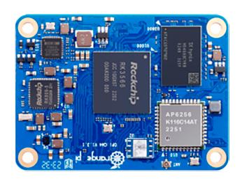
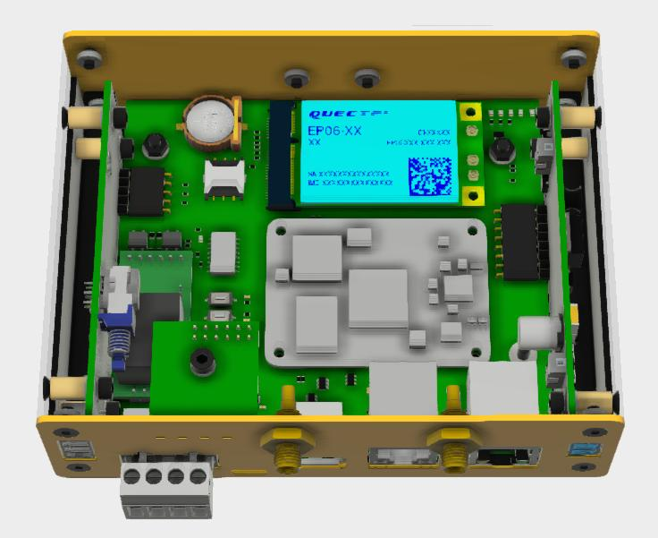

## Очередное обновление NapiLinux5- 0.2.4

>**Скачать: https://download.napilinux.ru/napilinux/0.2.4/**

## Что нового

- Поддержка популярнейшего чипа Orange CM4 и **[FCUCM4](https://napiworld.ru/docs/computers-industrial/FCUCM4/)**  на его основе.

>:fire: Похоже, мы первые кто собрал Linux для CM4 на ядре 6.х :fire:

- Новая программка [modlink](https://gitlab.nnz-ipc.net/pub/modlink): обраный шлюз Modbus TCP -> Modbus RTU.

*Модуль Orange CM4*

*Сборщик-Универсал **[FCUCM4](https://napiworld.ru/docs/computers-industrial/FCUCM4/)** на основе Orange CM4*

## Технический лог

- Добавлена поддержка **Orange Pi CM4** (u-boot, ядро, swupdate, hwrevision).
- Обновлены оверлеи для **rk3568** и **rk3308**.
- Переработан рецепт **u-boot** для Rockchip BSP.
- Добавлены новые рецепты: **linux-napi-opi-cm4**, **modlink 0.1**.
- Обновлены версии зависимостей в связи с найденными уязвимостями (**CVE**).

>Обновляйтесь и тестируйте новую сборку!
