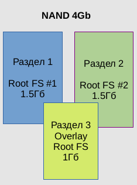
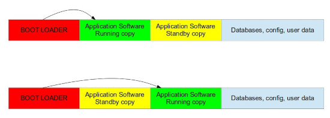

# Архитектура и состав

## Структура разделов

NapiLinux оптимизирован для embedded-систем и изначально спроектирован с учетом длительной автономной работы, возможности обновления системы и откатов. Основное отличительное свойство NapiLinux от классических дистрибутивов (Debian, Ubuntu, DietPi) — дублирующие друг друга разделы с системой и отдельный раздел с пользовательскими данными.

|partition      | size                  |ro\rw|
|---------------|-----------------------|-----|
|/dev/mmcblk1p1 | 1.5G Linux filesystem | ro  |
|/dev/mmcblk1p2 | 1.5G Linux filesystem | not mounted  |
|/dev/mmcblk1p3 |  1G  Linux filesystem| rw |

Система может грузиться как с раздела 1 (/dev/mmcblk1p1), так и с раздела 2 (/dev/mmcblk1p2). При обновлении системы обновляется один из разделов (более «старый»). Если обновление прошло неудачно, система загрузится с другого раздела. Раздел 3 (/dev/mmcblk1p3) с пользовательскими данными содержит все конфиги, пользовательские файлы, базы данных и так далее. Чтобы сделать резервную копию, не нужно копировать всю систему, достаточно сделать резервную копию этого раздела. Чтобы «обнулить» систему, достаточно стереть все данные этого раздела. 

## Состав системы

Система имеет базовый состав пакетов, к которому имеются расширения и рецепты
с дополнительным функционалом.

### Базовые компоненты

>В свежих сборках версии пакетов могут быть более свежие. 

|компонента      | версия                  |
|---------------|-----------------------|
|kernel | 6.3.0 |
|uboot|2023.04|
|swupdate|2023.05|
|busybox|1.35|
|modemmanager| 1.18.8-r0 |
|modpoll|1.0.0-r1|
|minicom|2.8-r0|
|i2c-tools|4.3-r0|

:boom: оболочка: bash

### Компоненты сбора данных

>В свежих сборках версии пакетов могут быть более свежие. 

Состав опроса датчиков включает в себя базовый состав системы
и дополнительные пакеты.

|компонента      | версия                  |
|---------------|-----------------------|
|python3|3.10.9|
|python3-flask|2.1.1|
|telegraf|1.24.2-r1|
|modpoll|1.0.0|
|mbpoll|1.0.0|
|modemmanager|1.18.8|
|mosquitto|2.0.14|
|grafana|9.3.6|
|influxdb2|2.6.1-r1|
|mbusd|0.5.2|

:::tip

Расширенный состав включает в себя «тяжелые» пакеты, такие как telegraf, grafana, influxdb. По умолчанию эти службы выключены. Службу grafana не рекомендуется включать на процессорах rk3308.
:::
