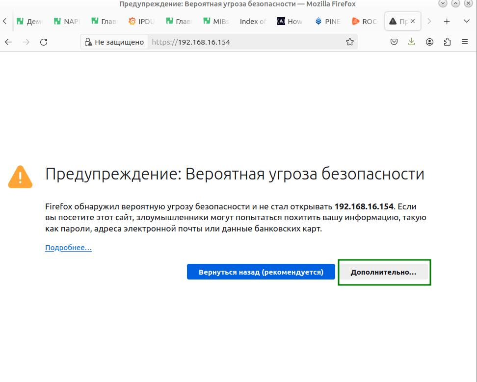
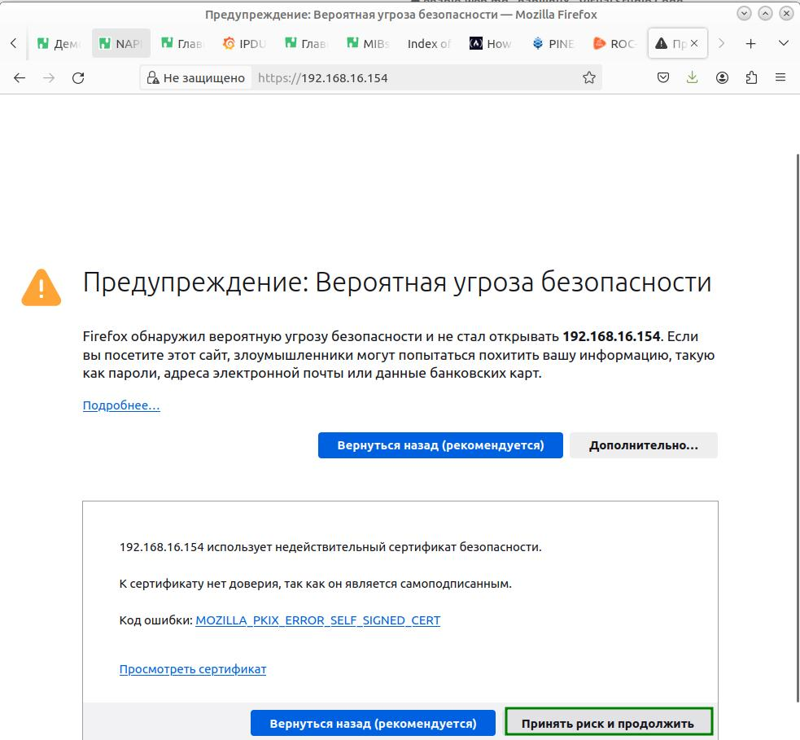
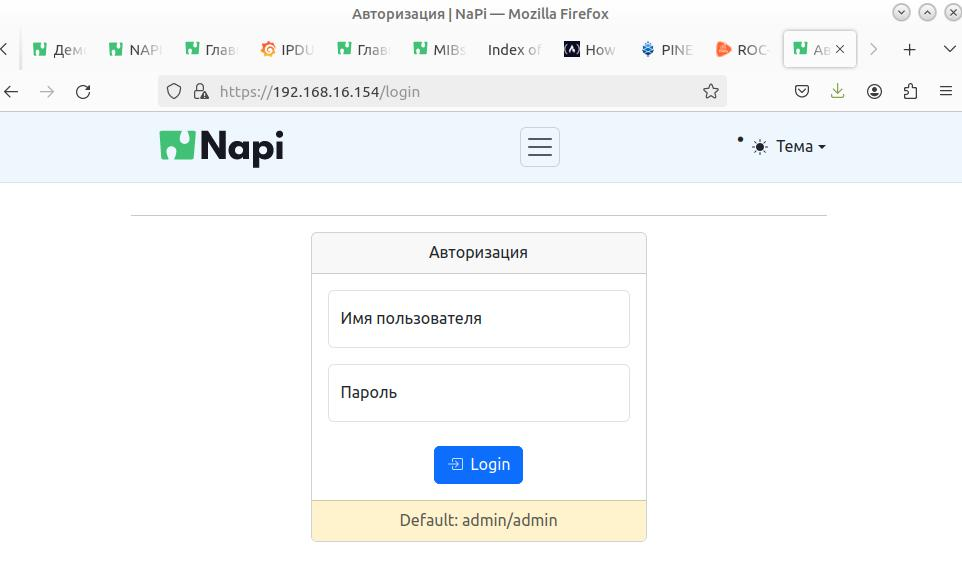
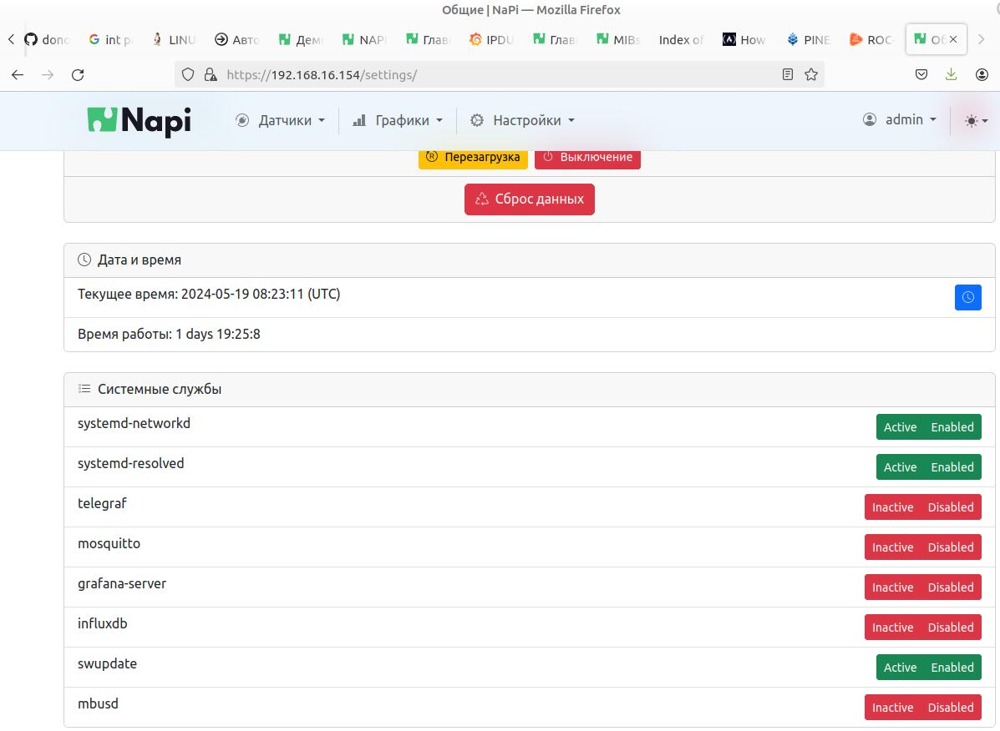
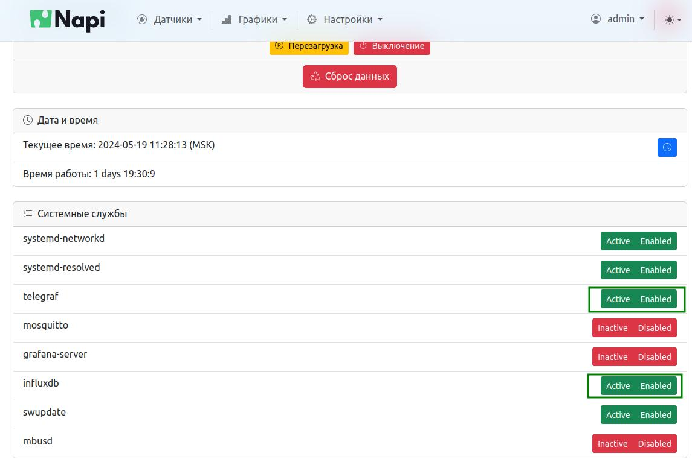
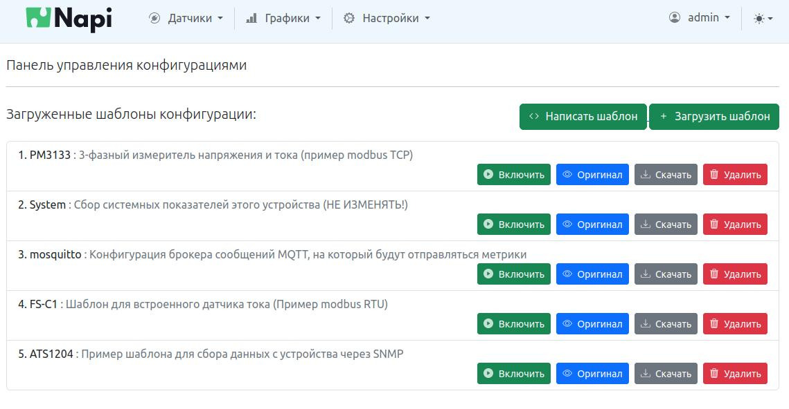
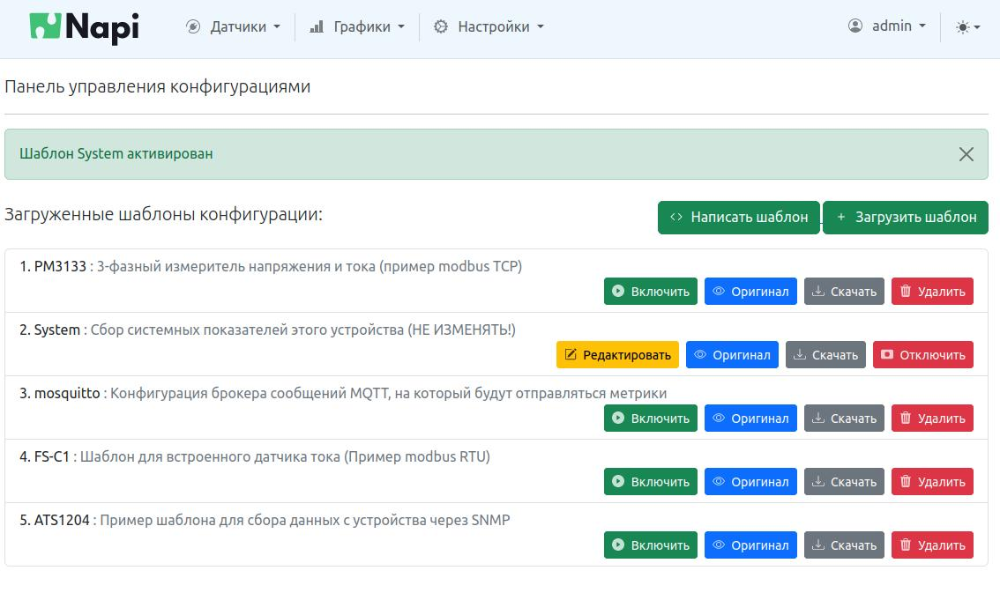
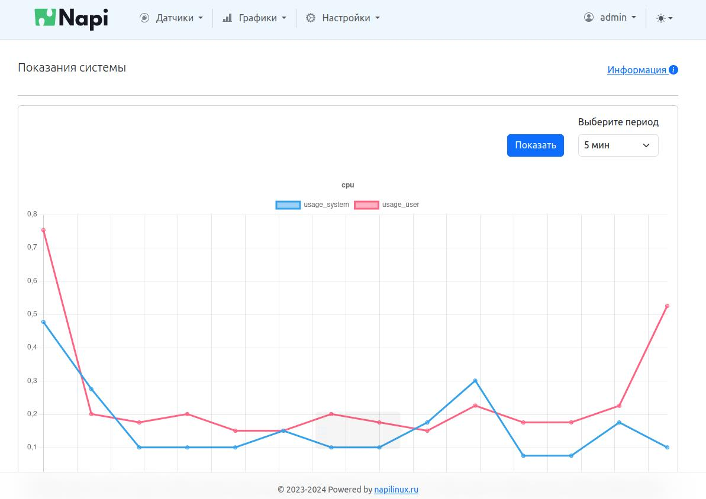

# NapiConfig: первый запуск

NapiConfig доступен по адресу:

> https://ваш_ip

Броузер "ругнется" на неподписанный сертификат



Нужно принять риск и войти



Логин\пароль: admin\admin



## Включение службы NapiConfig 

В некоторых сборках, все дополнительные службы по умолчанию выключены.
Чтобы включить Веб-интерфейс управления системой, нужно зайти по SSH
и выполнить следующие команды

```bash

systemctl enable  gunicorn
reboot

```
:warning: Перезагрузка обязательна !

После этого можно заходить в NapiConfig по адресу


## Запуск служб

>По умолчанию службы telegraf, influx, mqtt, mbusd, grafana ВЫКЛЮЧЕНЫ. Это сделано, чтобы система была максимально не загружена по умолчанию под задачи.

Включите нужные службы из меню "Настройки\Общие"



- Если Вы решили сделать modbus шлюз включите службу mbusd
- Если вы работаете с датчиками, включите telegraf и influx
- Если вы будете отображать данные через Grafana, включите службы telegraf, inflx, grafana (запускать grafana не рекомендуется на устройствах NAPI)

Запустим telegraf + influx



## Активация датчика System

Работа с датчиками происходит в меню "Датчики\Управление"




После включения служб telegraf + influx, можно активировать встроенный датчик System (Включить)



### Встроенные графики

После активации датчика System в разделе "Графики\Системные" будут доступны данные по загрузке системы (с момента активации датчика System)


