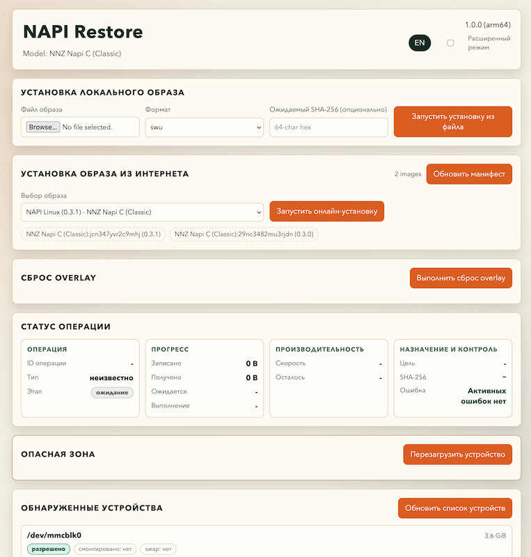
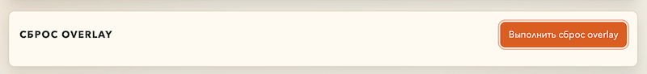
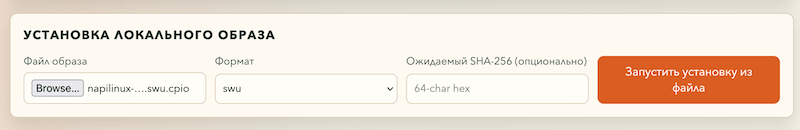
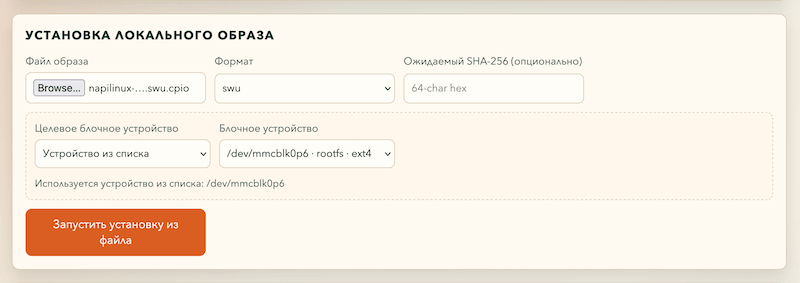

# Восстановление системы

Эта инструкция предназначена для работы с веб-интерфейсом NAPI Restore. Откройте в браузере адрес:

Recovery-режим и описанные в этой инструкции, доступен в NapiLinux начиная с версии `0.4.0`.

```text
http://<IP-адрес-устройства>:8080
```

IP-адрес устройства выдаёт роутер. При необходимости найдите его в списке подключённых устройств роутера.

> **Внимание:** операции восстановления необратимы. Перед запуском убедитесь, что выбрана нужная цель. Не выключайте питание и не перезагружайте устройство, пока в блоке «Статус операции» не появится «Завершено».



## Перед началом

1. Откройте блок «Обнаруженные устройства» в нижней части страницы.
2. Найдите целевое устройство по его размеру, имени и меткам разделов. Не определяйте носитель только по имени вида `mmcblk0` или `mmcblk1`: на разных устройствах они могут соответствовать разным накопителям.
3. Не выбирайте устройство со статусом «заблокировано» или «смонтировано».

NAPI Restore не позволяет целиком перезаписывать используемые, смонтированные и recovery-устройства. Поэтому носитель, с которого загружено восстановление, нельзя записать полным образом в текущем сеансе. Например, при загрузке с SD-карты можно записать полный образ во внутреннюю память, но не на эту же SD-карту. Обновление только раздела rootfs на активном носителе доступно.

## Ручной вход в recovery

Чтобы загрузить устройство в recovery вручную, подключитесь к устройству с правами администратора: по SSH через сеть или через [UART-консоль](https://napiworld.ru/software/console/console/). Затем выполните:

```sh
fw_setenv sys_upgrade true
fw_setenv recoveryargs shell
```

После выполнения команд перезагрузите устройство. При следующей загрузке оно перейдёт в recovery-режим.

## Сброс пользовательских настроек

Сброс overlay возвращает систему к заводскому состоянию: удаляет пользовательские изменения, настройки и данные, хранящиеся в overlay. Базовая система при этом не переустанавливается.

1. В блоке «Сброс overlay» нажмите «Выполнить сброс overlay».
2. В окне подтверждения проверьте действие и цель, затем нажмите кнопку подтверждения.
3. Когда появится запрос, введите `reset` и подтвердите операцию.
4. Дождитесь статуса «Сброс overlay выполнен» или «Завершено».
5. Перезагрузите устройство кнопкой «Перезагрузить устройство» в блоке «Опасная зона».



## Полная переустановка системы из образа `.xz`

Этот вариант записывает полный образ на выбранное блочное устройство. Все данные на нём будут удалены. Используйте его, например, чтобы записать систему с SD-карты на внутреннюю память.

1. Скачайте последнюю версию полного образа с [download.napilinux.ru/napilinux](https://download.napilinux.ru/napilinux/). Выберите файл с расширением `.xz`.
2. В блоке «Установка локального образа» нажмите выбор файла и укажите скачанный `.xz`-файл.
3. В поле «Формат» выберите `xz`.
4. Включите «Расширенный режим» в правом верхнем углу.
5. В поле «Целевое блочное устройство» выберите «Устройство из списка».
6. В поле «Блочное устройство» выберите весь нужный накопитель, а не отдельный раздел. Ориентируйтесь по размеру и данным из блока «Обнаруженные устройства».
7. Нажмите «Запустить установку из файла».
8. В окне подтверждения ещё раз проверьте выбранное устройство и подтвердите запуск.
9. Дождитесь статуса «Завершено», затем перезагрузите устройство.


## Восстановление только rootfs из `.swu`

Этот вариант заменяет только rootfs. Он не предназначен для записи полного образа накопителя.

Для восстановления рекомендуется использовать `.swu` той же версии, которая была установлена на устройстве до сбоя.

1. Скачайте файл обновления с расширением `.swu` с [download.napilinux.ru/napilinux](https://download.napilinux.ru/napilinux/)
2. В блоке «Установка локального образа» выберите этот файл.
3. В поле «Формат» выберите `swu`.
4. Если нужно восстановить rootfs, настроенный по умолчанию, оставьте выключенным «Расширенный режим» и нажмите «Запустить установку из файла».
5. Чтобы указать rootfs другого накопителя, включите «Расширенный режим», выберите «Устройство из списка» и укажите раздел с меткой `rootfs`. Целью этой операции должен быть раздел rootfs, а не весь накопитель.
6. Проверьте цель в окне подтверждения и подтвердите операцию.
7. Дождитесь статуса «Завершено», затем перезагрузите устройство.

Если recovery запущен с SD-карты, через «Расширенный режим» можно восстановить rootfs как во внутренней памяти, так и на этой SD-карте. Для SD-карты выбирайте только раздел с меткой `rootfs`; полная запись образа на активную SD-карту недоступна.

Режим по-умолчанию


Режим расширенный


## Расширенный режим

Расширенный режим нужен только для выбора цели, отличной от заданной по умолчанию.

- «По-умолчанию» использует заранее настроенную цель.
- «Устройство из списка» позволяет выбрать доступное устройство или раздел из списка. Это рекомендуемый вариант для нестандартной цели.
- «Указать вручную» требует ввести путь вида `/dev/...` дважды. Используйте его только если точно знаете путь к нужному устройству.

Перед подтверждением всегда сверяйте поле «Устройство» в диалоговом окне с накопителем или разделом, который должен быть перезаписан.

## Если операция завершилась ошибкой

1. Не перезагружайте устройство, пока не поймёте причину ошибки.
2. Откройте «Обнаруженные устройства» и убедитесь, что выбранная цель не отмечена как «заблокировано» или «смонтировано».
3. Убедитесь, что выбран правильный формат: `xz` для полного образа и `swu` для rootfs.
4. Повторите операцию только после исправления причины ошибки.

Если ошибка повторяется, сохраните её текст из блока «Статус операции» и передайте его специалисту поддержки вместе с моделью устройства и выбранным файлом образа.

## Полная прошивка по кабелю

Если восстановить систему через NAPI Restore не удалось, воспользуйтесь полной прошивкой устройства по кабелю. Эта операция полностью перезаписывает внутреннюю память устройства.

- Для Linux: [инструкция по установке Flash Backup](https://napiworld.ru/software/flash-backup/install_lin).
- Для Windows: [инструкция по установке Flash Backup](https://napiworld.ru/software/flash-backup/install_win).
