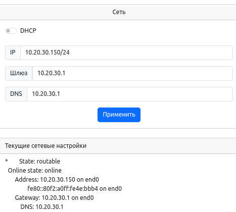
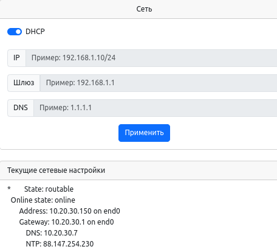

# Настройка сети

Сетевые параметры задаются через конфигурационные файлы systemd 

```bash
/etc/systemd/network/20-wired.network
```

## Установка IP-адреса на Ethernet интерфейс

IP параметры можно задавать вручную (через Веб или непосредственно в файле конфигурации) или получать через DHCP.

### Статический IP адрес через Веб



### Статический IP адрес через ssh

```bash
root@napi-rk3308b-s:~# cat /etc/systemd/network/20-wired.network
[Match]
Name=end0

[Network]
Address=10.20.30.150/24
Gateway=10.20.30.1
DNS=10.20.30.1


```

### Динамический IP адрес через Веб



### Динамический IP адрес через ssh

```bash

root@napi-rk3308b-s:~# cat /etc/systemd/network/20-wired.network
[Match]
Name=end0

[Network]
DHCP=ipv4
LinkLocalAddressing=ipv4
IPv6AcceptRA=no
IPv4LLStartAddress=169.254.100.100

[DHCP]
RouteMetric=10
ClientIdentifier=mac

```
