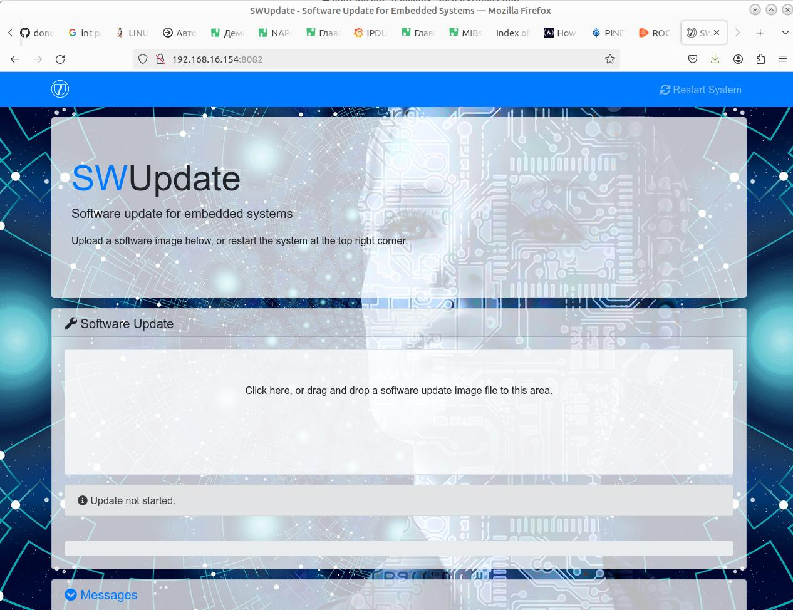
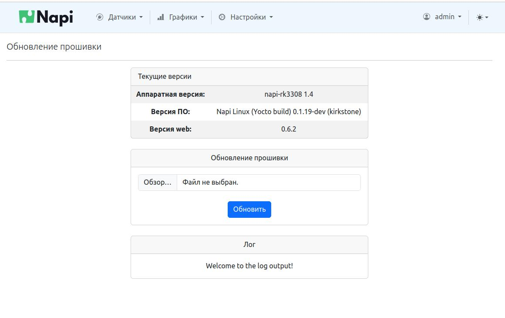

# Обновление NapiLinux

Система имеет встроенный механизм для обновления прошивки без
затрагивания пользовательских данных.

Обновить систему можно, зайдя через веб-интерфейс на порт 8082:
`http://<napi ip>:8082`

- Перетащите файл с обновлением (есть в папке с сборкой прошивки)
- Подождите, пока файл загрузится и пройдет обновление
- Перегрузите систему через NapiConfig или SSH

Видео с процессом обновления системы: https://www.youtube.com/watch?v=gq0CKPTbuF8&t=22s

:::tip

Обновление также можно осуществить из NapiConfig (Настройки-Обновление)

:::