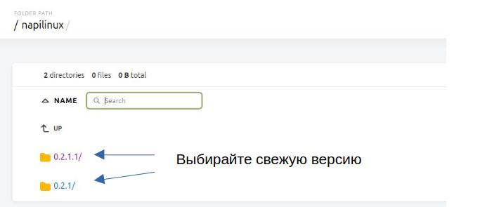
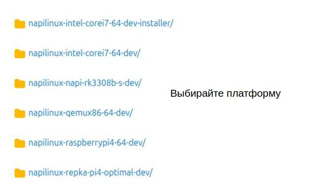
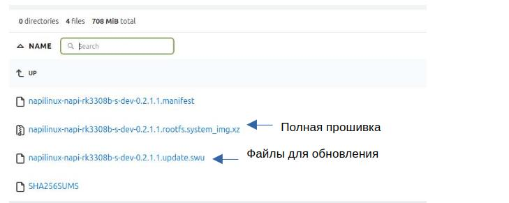

# Загрузка и прошивка

> :fire:Прошивки с ОС NapiLinux по ссылке: **https://download.napilinux.ru/napilinux/**


## На сайте download.napilinux.ru

Версия соответствует каталогу



В имени папки - платформа для которой предназначена прошивка




:::tip Файлы на сервере

- Файл xxx-rootfs_wic.xz - полная прошивка
- Файл xxx-.swu - апдейт

:::



:::tip Программы для прошивки

На SD карту прошить можно программами

- balenaEtcher: https://etcher.balena.io/ (для прошивки можно сразу указывать файл xz, сама разожмет)
- Rufus: https://rufus.ie/ru/

:::

> Старые прошивки доступны по ссылке: **https://download.napilinux.ru/linuximg/napilinux/**

##  Краткие инструкции по установке

### NAPI-C, NAPI-P, Сборщик, Токосборщик

> Чтобы быстро попробовать достаточно прошить файл с прошивкой на SD карту программой BalenaEther или Rufus.

- Подробные инструкции есть на сайте http://napiworld.ru.
- Есть несколько способов прошивки, [выбирайте удобный](https://napiworld.ru/software/category/%D0%BF%D1%80%D0%BE%D1%88%D0%B8%D0%B2%D0%BA%D0%B0-%D0%B1%D0%B5%D0%BA%D0%B0%D0%BF).

>:point_up: Во всех примерах конкретную версию файла смотрите на сайте скачиваний и поставляйте вместо приведенной в примере

### Repka Pi 4

>Достаточно прошить файл с прошивкой для Repka на SD карту программой BalenaEther или Rufus.

Как прошить в EMMC

- Прошить SD загрузится
- Зайти и выполнить команду

```
wget -O - https://download.napilinux.ru/napilinux/0.2.1.1/napilinux-repka-pi4-optimal-dev/napilinux-repka-pi4-optimal-dev-0.2.1.1.rootfs.system_img.xz \
| xz -T0 -d \
| dd of=/dev/mmcblk2 bs=4M status=progress

```

Можно заранее скачать прошивку

```
xz -T0 -d --stdout napilinux-repka-pi4-optimal-dev-0.2.1.1.rootfs.system_img.xz \
| dd of=/dev/mmcblk2 bs=4M status=progress

```

Эти команды разжимают файл с прошивкой и копируют его в EMMC

### Rasberry PI 4

>Достаточно прошить файл с прошивкой для Repka на SD карту программой BalenaEther или Rufus.


### X86 (64bit)

- Скачать файл с инсталлером: napilinux-intel-corei7-64-dev-installer-0.2.1.1.rootfs.system_img.xz
- Через Balena или Rufus прошить на USB-флешку
- Загрузится с флешки (f12 и выбрать источник загрузки)
- Указать устройство куда разместить NapiLinux (как правило это /dev/sda1)

### Виртуальная машина QEMU

```
qemu-system-x86_64 \
  -enable-kvm -cpu host \
  -machine type=q35 \
  -m 2048 \
  -smp sockets=1,cores=4 \
  -drive file=./napios-qemux86-64-dev-0.2.0.1.rootfs.system_img,if=none,id=hd0,format=raw \
  -device virtio-scsi-pci \
  -device scsi-hd,drive=hd0 \
  -boot order=d \
  -netdev user,id=net0,hostfwd=tcp::2222-:22,hostfwd=tcp::8080-:80,hostfwd=tcp::8443-:443 \
  -device virtio-net-pci,netdev=net0


```

- Порты:

    • 2222 → 22 (SSH);
    • 8080 → 80 (HTTP);
    • 8443 → 443 (HTTPS)

- Доступ по ssh

```
ssh root@192.168.0.18 -p 2222
```

- Доступ к NapiConfig2

https://192.168.0.18:8443/

IP: 192.168.0.18 это IP, выделенный виртуальной машиной.
