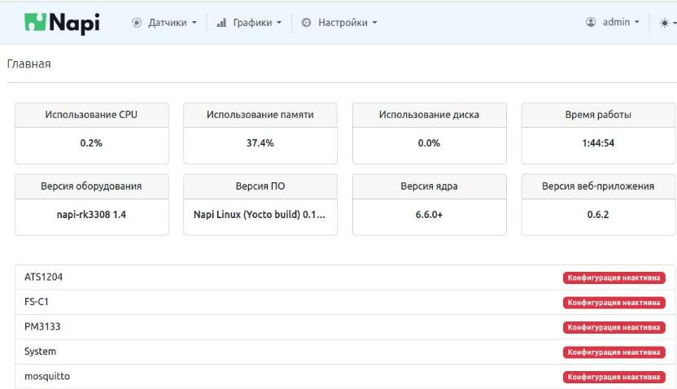
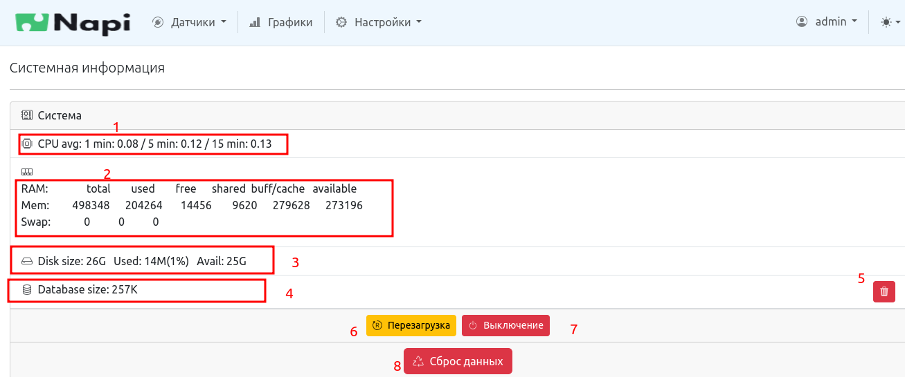
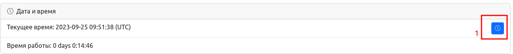
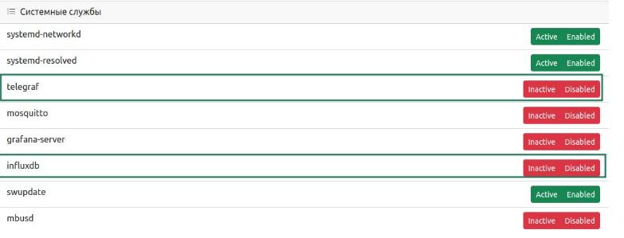

# Системные параметры и мониторинг

## Главная страница

## Вход в меню управления системными параметрами

## Функционал управления и мониторинга

### Пояснения к интерфейсу

Мониторинг

1. Загрузка процессора;
2. Использование оперативной памяти;
3. Использование постоянной памяти (SD\EMMC\NAND);
4. Текущий объем базы данных датчиков.

Действия

5. Удалить (полностью пересбросить базу данных датчиков);
6. Перезагрузка устройства;
7. Выключение устройства;
8. Сброс настроек в режим "по умолчанию".

## Дата и время

### Пояснения к интерфейсу

- Мониторинг текущего времени системы. Возможно установить системное время (при наличии интернет-канала);
- Время работы с последней перезагрузки.

## Мониторинг системных служб

### Пояснения к интерфейсу

- Active\Inactive запускает или останавливает сервис
  
  > Active - systemctl start service

  > InActive - systemctl stop service;
  
- Enabled\Disabled активирует \ декативирует службу при старте системы
  
  > Enable - systemctl enable
  
  > Disable - systemctl disable
  
- Некоторые сервисы работают в паре (telegraf\influxdb)
   

