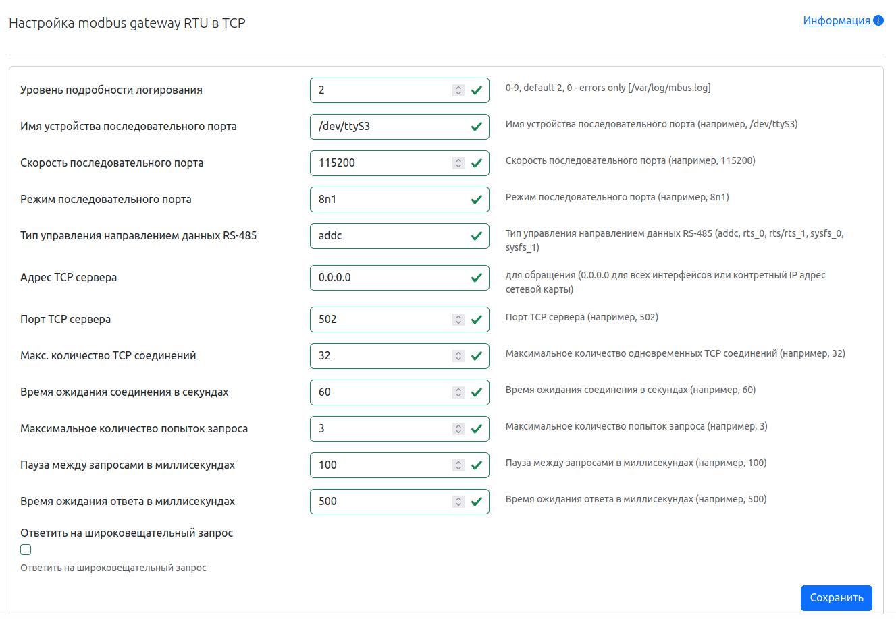

# Управление Modbus - шлюзом

В составе NapiLinux имеется свободное программное обеспечение [mbusd](https://github.com/3cky/mbusd), реализующее функционал шлюза Modbus RTU - Modbus TCP. 

NapiConfig предоставляет интерфейс к конфигурационных файлу с контролем параметров и позволяет управлять запуском службы.

