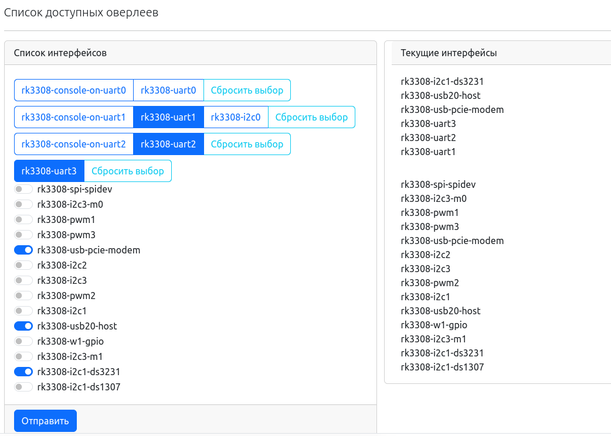

# Управление оверлеями

Так как устройства под управлением NapiLinux могут иметь разные интерфейсы, мы подготовили раздел NapiConfig для включения интерфейсов без пересборки имиджа.

## Вход в меню управления оверлеями

:boom: В настоящее время поддерживаются устройства на процессоре RK3308

## Включение и выключение оверлеев

Пояснения

В системе NapiLinux можно включать\выключать

- UART-интерфейсы
- I2c интерфейсы
- RTC интерфейсы
