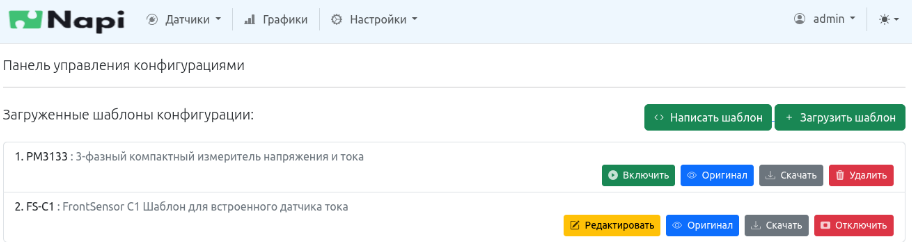
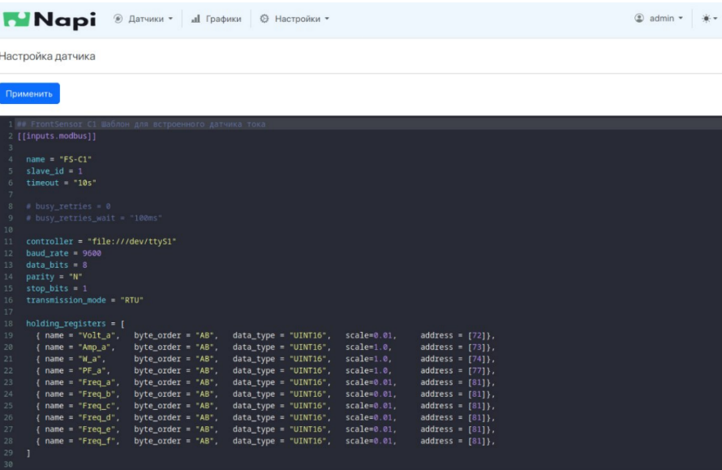
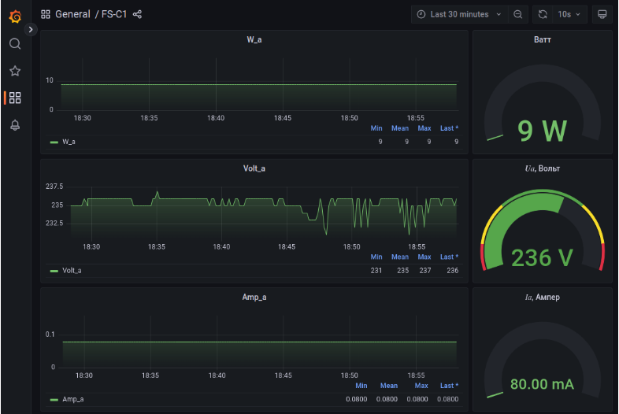
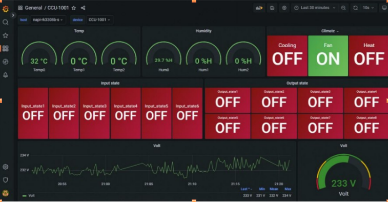
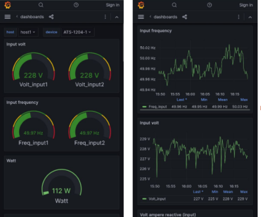

# Работа с датчиками

## Интерфейс работы с датчиками

Возможность добавлять \ удалять \ редактировать датчики

Возможность редактировать конфигурацию опроса датчика из Веб

## Отображение графиков (с помощью инструмента Grafana)

Отображение графиков с датчика тока modbus rtu через Веб

Отображение может идти не только с датчиков, но и любых устройств, которые в состоянии опросить telegraf

Интерфейс автоматически оптимизируется под разрешение смартфонов

