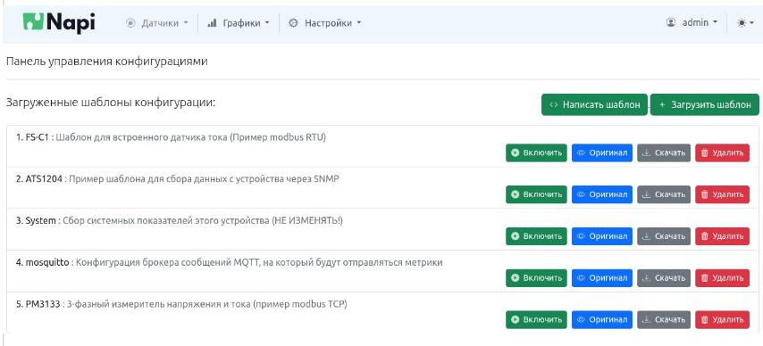
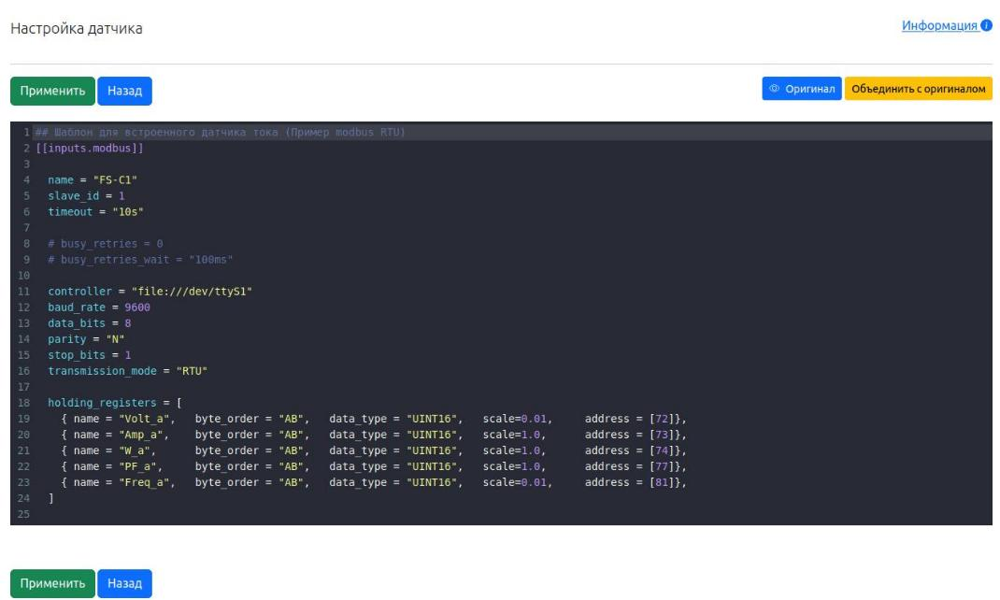
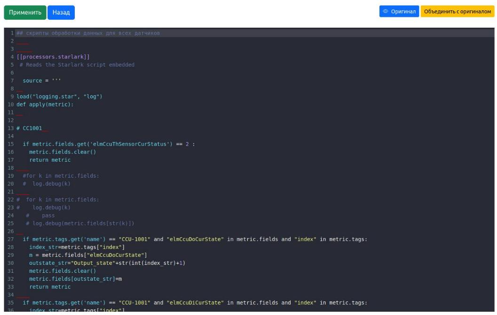
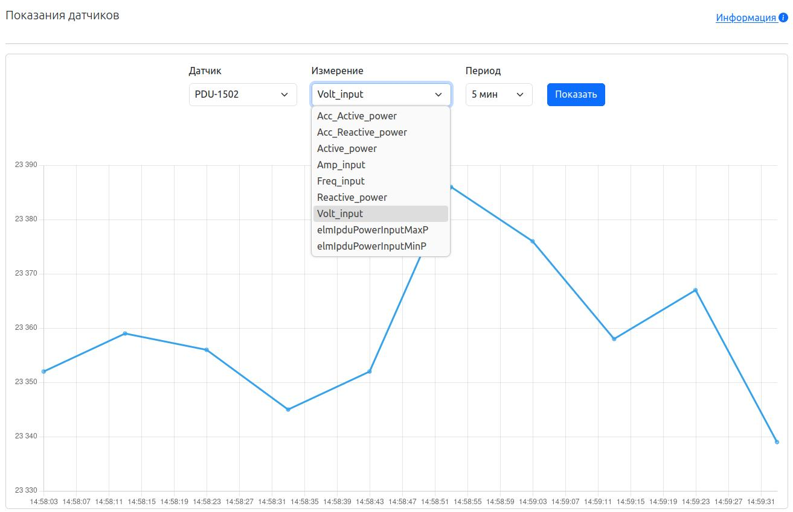

# Работа с датчиками

Мы используем "комбайн" [Telegraf](https://www.influxdata.com/time-series-platform/telegraf/) для опроса разнородных данных и 
отправления их в базу данных \ mqtt потоки. Для Telegraf разработано множество [плагинов](https://docs.influxdata.com/telegraf/v1/plugins/), которые позволяют опрашивать устройства \ интерфейсы по различным протоколам. 

Мы сделали шаблоны для опроса устройств по 

- Modbus RTU
- Modbus TCP
- SNMP

Данные мы "складываем" в базу данных influx. В дальнейшем можно работать с данными через различные визуализаторы, например Grafana. 

>Вы можете написать любой конфиг в формате Telegraf используя input плагины на датчик и при корректном конфиге он автоматически заработает. 

>Также вы можете хранить данные в любой другой базе, транслировать в mqtt потоки или распорядиться данными по другому, применяя output плагины Telegraf.   

>Короткое видео, в котором мы добавляем шаблон SNMP-датчика, добавляем необходимые MIB-файлы, редактируем IP (размыто) и убеждаемся, что данные поступают (открываем встроенный график датчика): https://youtu.be/yzN-tAXPDhg

## Интерфейс работы с датчиками

### Возможность добавлять \ удалять \ редактировать датчики

Вы можете написать конфиг датчика с нуля "написать шаблон" или загрузить уже протестированный\готовый конфиг "Загрузить шаблон" (в дальнейшем можно редактировать) или воспользоваться одним из наших шаблонов.

Готовые шаблоны:


После включения шаблон можно редактировать. Важно, что вы редактируете копию шаблона, а не сам шаблон. При выключении датчика, если не объединить копию с шаблоном, копия пропадет. Кнопка объединения копии и шаблона доступна в интерфейсе редактирования датчика. 


### Редактирование конфигурации опроса датчика 



- При нажатии кнопки "применить" система запустит Telegraf и включит в конфигурацию Ваш конфиг. 
- Когда конфиг датчика отлажен, необходимо нажать на кнопку "Объединить с оригиналом", чтобы обновился шаблон.

### Обработка данных

Telegraf позволяет обрабатывать данные перед отправкой в базу данных. так называемые "процессоры" тоже описываются в конфигурационных файлах, поэтому 
достаточно сделать виртуальный "датчик" и описать в нем процес обработки данных.  

Мало того, процессор starlark позволяет писать логику обработки данных на языке starlark (который очень похож на python). Мы используем starlark для разбора snmp oid, переименования метрик, пропуска ненужных значений.



:::tip Что у нас "под капотом"

- Каждый датчик имеет свой файл конфига, все конфиги датчиков располагаются в каталоге `/data/active`.
- Основной конфиг (где описан метод складирования данных) находится в стандартном месте `/etc/telegraf/telegraf.conf` и может быть отредатирован вручную (как правило, не требуется).
- В Веб интерфейсе неочевидно, почему telegraf не запустился, а, если запустился, какие метрики он опрашивает. Поэтому мы рекомендуем отлаживать опрос данных из командной строки. 

>Для проверки работы всех датчиков: в командной строке набрать команду(останавливать службу telegraf при этом необязательно)

```bash 
root@napi-rk3328:~# telegraf --test -config /etc/telegraf/telegraf.conf --config-directory /data/active/ 
```

>Для проверки работы конкретного датчика (очень помогает при отладке): в командной строке набрать


```bash 
root@napi-rk3328:~# telegraf --test -config /etc/telegraf/telegraf.conf --config /data/active/<файл датчика> 
```

Также для подробного вывода можно использовать флажок `--debug

- Узнать запустилась ли служба можно командой

```bash 
systemctl status telegraf
```

- Посмотреть лог почему telegraf не запускается

```bash
journalctl -u telegraf
```

:::

## Отображение данных с датчиков

В NapiConfig есть механизм внутреннего отображения графиков с данных, которые поступают с датчиков. Можно выбрать датчик и измерение (метрики из базы этого датчика). Это не полноценный инструмент визуализации, но он позволяет посмотреть какие данные попадают в базу данных (и работает ли вообще опрос датчика), а также оценить качественно поступающие данные.

На рисунке видно, каике данные (метрики в "Изменение") поступают с датчика PDU-1502. 



>Надо отметить, что данные отображаются без обработки. На графике видно, что значение Volt_input датчик передает в формате "23300".

## Отображение графиков с помощью инструмента Grafana

:::tip

В сборку NapiLinux включен пакет grafana-server для визуализации данных из influx. Однако, это "ресурсоёмкий" пакет и на процессорах rk3308 (Napi устройства) запуск службы grafana сильно тормозит систему. Поэтому для Napi устройств мы рекомендуем развернуть grafana на отдельном хосте и осуществлять отображение всех устройств Napi с хоста.


На более мощных процессорах (rk3328, rk3399, rk3560, rk3588) возможно использовать grafana прямо на устройстве.  

:::
Отображение графиков с датчика тока modbus rtu через Веб

## Примеры отображения данных через grafana


Отображение может идти не только с датчиков, но и любых устройств, которые в состоянии опросить telegraf


Интерфейс автоматически оптимизируется под разрешение смартфонов


