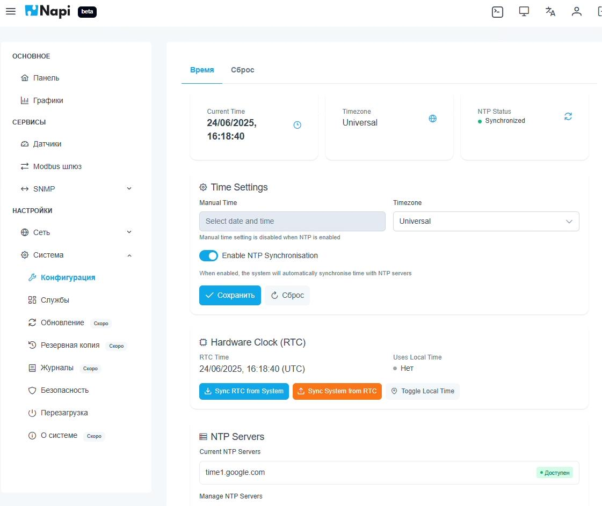
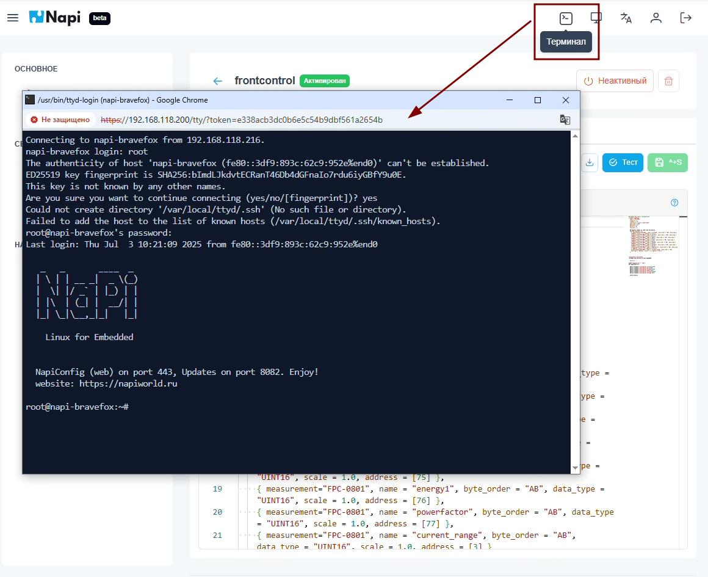

# NapConfig 2.0

> **NapiConfig2 на основе Napi.Api** доступен в NapiLinux через Веб-интерфейс на порту 443. Это легкий быстрый и реактивный Веб-интерефейс на движке Vue и FastApi.

## Главная страница

## Управление интерфейсами ethernet

## Список датчиков

## Обнуление базы данных датчиков

## Редактирование конфига датчика

## Тестирование конфигурации датчика "на лету"

## Загрузка датчика из репозитория

## Графики регистров датчика

## Графики с множителем и изменением интервала

## Шлюз Modbus RTU - Modbus TCP

## Изменение даты и времени

## Полный сброс системы

## Управление службами Linux

## Управление службами Linux с фильтрацией

## Терминал ssh

