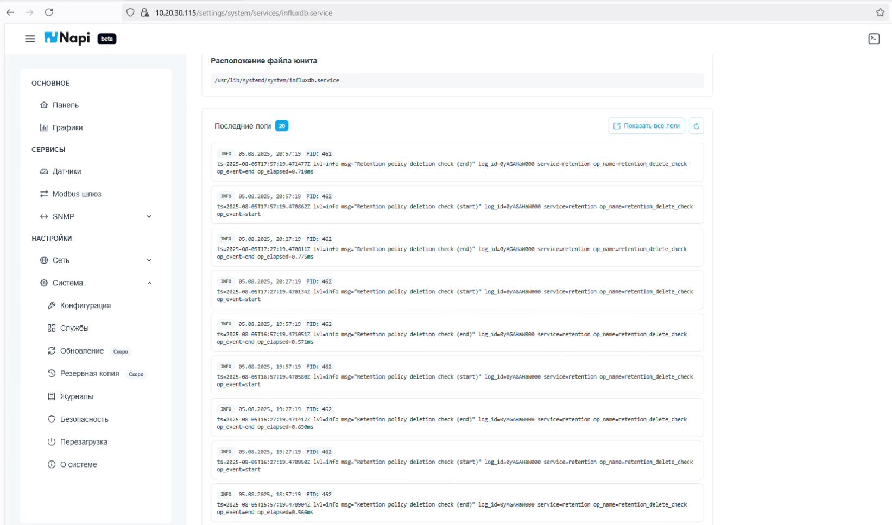

# NapiConfig 2.0

> **NapiConfig2 на основе Napi.Api** доступен в NapiLinux через веб-интерфейс на порту 443. Это легкий, быстрый и реактивный веб-интерфейс на движке Vue и FastAPI.

## Главная страница

## Управление интерфейсами Ethernet

## Список датчиков

## Обнуление базы данных датчиков

## Редактирование конфигурации датчика

## Тестирование конфигурации датчика «на лету»

## Загрузка датчика из репозитория

## Графики регистров датчика

## Графики с множителем и изменением интервала

## Шлюз Modbus RTU - Modbus TCP

## Изменение даты и времени

## Полный сброс системы

## Управление службами Linux

## Управление службами Linux с фильтрацией

## Терминал SSH

## Логи служб

