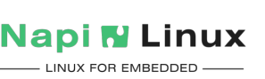

## Общие сведения

NapiLinux - дистрибутив для встраиваемых систем. Основные принципы NapiLinux - "ничего лишнего" и резервирование.  NapiLinux собирается в среде Yocto из исходных кодов на основе базовой конфигурации и рецептов под конкретные реализации устройств. Пользователи могут самостоятельно 
дополнять дистрибутив своими рецептами и слоями для своих плат. В NapiLiux нет пакетного менеджера, пользователь (или мы) сам добавляет пакеты в свой вариант сборки. **Это делает прошивку монолитной и устойчивой, какой и должен быть дистрибутив для встройки**.

:::info
Мы как команда разработчиков будем рады если NapLinux будет развиваться как по вариантам сборки, так и в плане поддержки других чипов и одноплатников. На данном этапе NapiLinux разрабатывается и тестируется на платформе процессорного модуля NAPI на основе чипа RK3308 и всех
устройств на этом модуле. NapiLinux также может быть установлен на RockPi S (производитель Radxa). В дальнейшем мы планируем поддержу других встраиваемых платформ.
:::

[Подробнее...](/docs/arch/)

:boom: [Документация](/docs/)

:boom: [Скачать образы](/download/)

:boom: [Обновления и новости проекта](/blog/)

## Зачем нам свой дистрибутив

NapiLinux оптимизирован для embedded систем и изначально спроектирован с учетом длительной автономной работы, возможностью апдейта системы и откатов. Основное отличительное свой свойство NapiLinux от классических дистрибутивов (Debian, Ubuntu, DietPi) - дублирующие друг друга разделы с системой и отдельный раздел с пользовательскими данными.

## Управление через Веб

Основные функции настройки Linux мы перекладываем на Веб-интерфейс и наше собственное API. В настоящее время в стандартной сборке можно конфигурировать сеть, мониторить основные сервисы и свободное место.

:::tip Таков путь
Следите за обновлениями. Мы только начали эту разработку и надеемся сделать хороший продукт
:::
