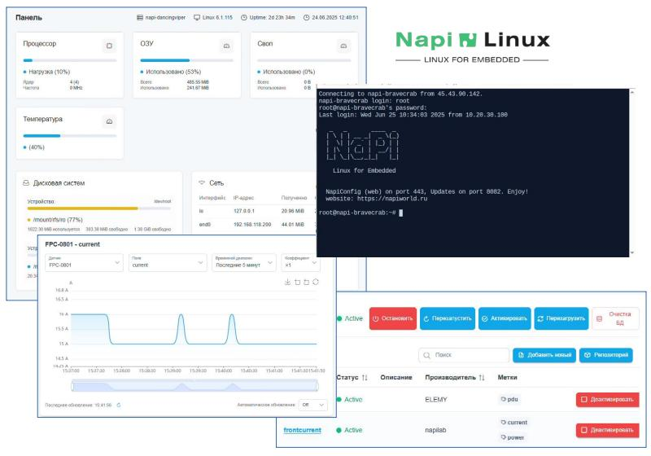

<!--  -->

## NapiLinux - Linux для embedded систем

>:fire: **Новая версия [NapiLinux и NapiConfig2](/blog/napilinux-0.2.1)** \
>:fire: **Вышло обновление [NapiLinux 0.2.3](/blog/napilinux-0.2.3)**

>***NapiLinux - дистрибутив для встраиваемых систем для работы с данными. Особенность нашей ОС - заточенность под сбор, хранение и преобразование данных с датчиков и других источников, резервирование и отказоусточивость. Прямо "из Вебки" (NapiConfig) можно "заводить" датчики в систему (через конфигурацию Telegraf) тестировать сбор данных, работать с данными через графики. И, конечно, бекапы, апдейты и откат в дефолт "из коробки".***

>**NapiLinux отлично подходит для одноплатных компьютеров, промышленных встраиваемых систем.**

## Из чего состоит NapiLinux

Napi Linux построен на основе Napi.Api - оператор или стороннее приложение не работает с устройством напрямую. Имеется интеграция для взаимодействия с сторонними приложениями через токены.

## NapiConfig: управление через Веб

>:fire: Для NapiLinux не требуется графическая среда (которая потребляет память и ресурсы), управление системой реализовано через Napi.Api. В систему встроен Веб-интерфейс [NapiConfig2](/napiconfig2/), позволяющий работать через Napi.Api через Веб-приложение на хосте оператора.

>:fire: Требования для системы минимальны - от 512Мб ОЗУ.

Основные функции настройки Linux мы перекладываем на Веб-интерфейс NapiConfig2 и наше собственное API.
[Подробнее...](/napiConfig/)

## Поддерживаемые платформы

:fire:**Прошивки и инструкции в разделе [Downloads](/downloads)**

### Российские платы

- **NAPI С\P: http://napiworld.ru**
- **Repka Pi: https://repka-pi.ru**

### Популярные платформы и архитектуры

- [Raspberry Pi](/downloads)
- [X86 (64bit)](/downloads)

### Виртуальные машины

- Образ [Qemu](/downloads)

### Мини-компьютеры на основе NAPI

- [Сборщик-компакт](https://napiworld.ru/docs/computers/frontcontrol-compact)
- [FrontControl 150.901](https://nnz-ipc.ru/catalogue/front_man/front_control/front_control_pc/)

:::info
Мы можем собрать и оптимизировать NapiLinux под Вашу платформу.
:::

## Зачем нам свой дистрибутив

>NapiLinux: Специализированный дистрибутив для Embedded-систем

**NapiLinux** — минималистичная и отказоустойчивая Linux-среда, оптимизированная под встраиваемые устройства с ограниченными ресурсами и длительным сроком эксплуатации.

В отличие от Debian, Ubuntu или DietPi, **NapiLinux** построен по архитектуре, ориентированной на надёжность и безопасные обновления:

- Дублирующие системные разделы (A/B) обеспечивают безопасное обновление и автоматический откат при сбое загрузки.
- Пользовательские данные хранятся отдельно от системной области, что сохраняет их при переустановке или обновлении ОС.

### Интерфейсы управления

Система предоставляет два интерфейса доступа:

- **Napi Api** — для автоматизации, удалённого управления и интеграции с внешними системами.
- **Веб-интерфейс** — быстрый и лёгкий UI для локального доступа и мониторинга.

Оба интерфейса работают на едином backend API, что упрощает сопровождение и обеспечивает единое поведение.

### Архитектура обновлений

- Atomic-обновления благодаря разделам A/B.
- Безопасная схема отката при ошибках запуска (в разработке)
- Возможность удалённого обновления по сети (в разработке)

### Централизованное управление множеством устройств на NapiLinux

Разрабатывается централизованный сервер управления, который позволит:

- Управлять парком устройств через один интерфейс.
- Массово деплоить обновления и настройки.
- Получать телеметрию и логи от всех узлов в реальном времени.

:::tip Таков путь
Тестируйте NapiLinux - все образы доступны. Подписывайтесь на канал @napiworld (https://t.me/napiworld) и пишите нам в чат канала.
:::
