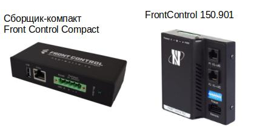

>:fire: **Что нового в [NapiLinux 0.1.19](../../blog/napilinux-0.1.19/)**  

## Общие сведения

NapiLinux - дистрибутив для встраиваемых систем. Основные принципы NapiLinux - "ничего лишнего" и резервирование.  NapiLinux собирается в среде Yocto из исходных кодов на основе базовой конфигурации и рецептов под конкретные реализации устройств. Пользователи могут самостоятельно 
дополнять дистрибутив своими рецептами и слоями для своих плат. В NapiLinux нет пакетного менеджера, пользователь (или мы) сам добавляет пакеты в свой вариант сборки. 
[Подробнее...](/docs/arch/)

>**Такой подход делает прошивку монолитной и устойчивой, какой и должен быть дистрибутив для "встройки" (embedded)**.

## NapiConfig: управление через Веб

Основные функции настройки Linux мы перекладываем на Веб-интерфейс и наше собственное API. 
[Подробнее...](/napiConfig/)

## Устройства, работающие на NapiLinux

Платы на основе [NAPI (rk3308)](http://napiworld.ru)

Платы на основе [rk3399](https://pine64.com/product/rockpro64-4gb-single-board-computer/) и [rk3328](https://en.t-firefly.com/product/rocrk3328pc.html)

Мини-компьютеры на основе NAPI: [Сборщик-компакт](https://napiworld.ru/docs/computers/frontcontrol-compact), [FrontControl 150.901](https://nnz-ipc.ru/catalogue/front_man/front_control/front_control_pc/)

Этот перечень будем расширять ! 

:::info
Мы как команда разработчиков будем рады если NapLinux будет развиваться как по вариантам сборки, так и в плане поддержки других чипов и одноплатников. Если Вас интересует NapiLinux для вашей платформы, свяжитесь с нами. 
:::

:boom: [Napi-документация](/docs/)

:boom: [Скачать образы](/download/)

:boom: [Обновления и новости проекта](/blog/)

## Зачем нам свой дистрибутив

NapiLinux оптимизирован для embedded систем и изначально спроектирован с учетом длительной автономной работы, возможностью апдейта системы и откатов. Основное отличительное свой свойство NapiLinux от классических дистрибутивов (Debian, Ubuntu, DietPi) - дублирующие друг друга разделы с системой и отдельный раздел с пользовательскими данными.

:::tip Таков путь
Следите за обновлениями. Мы только начали эту разработку и надеемся сделать хороший продукт
:::
